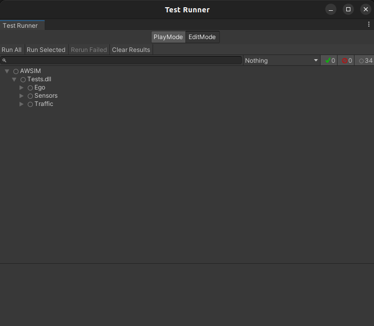
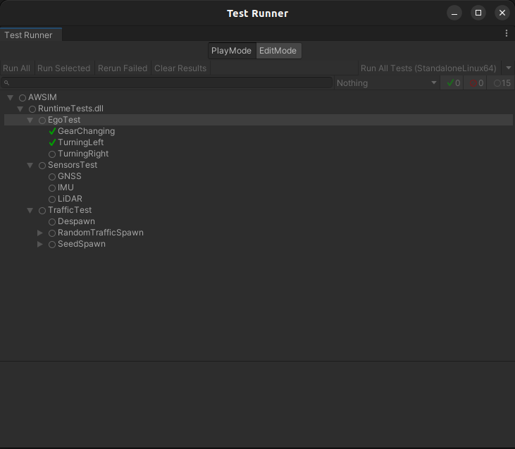
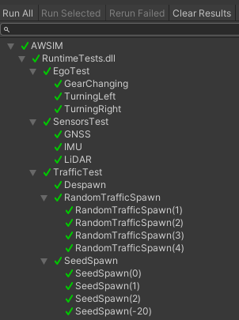

## Unity Test Framework
The AWSIM simulator utilizes the [Unity Test Framework (UTS)](https://docs.unity3d.com/Packages/com.unity.test-framework@1.1/manual/index.html) for comprehensive testing procedures. 

The Unity Test Framework is a testing framework provided by Unity Technologies for testing Unity applications and games. It is primarily used for automated testing of code written in C# within Unity projects. The framework allows developers to write test scripts to verify the behavior of their code, including unit tests for individual components and integration tests for multiple components working together. 

It provides various assertion methods to check expected outcomes and supports organizing tests into test suites for better management. The UTS is integrated directly into the Unity Editor, making it convenient for developers to run tests and analyze results within their development environment.

UTS uses an integration of NUnit library and looks for tests inside any assembly that references NUnit (detailed info can be found [here](https://docs.unity3d.com/Packages/com.unity.test-framework@1.1/manual/workflow-create-test-assembly.html)). AWSIM assembly is explicitely defined inside the project, so it can be referencered correctly by the test module.

## Edit Mode Tests and Play Mode Tests comparison
The framework enables testing code in both `Edit Mode` and `Play Mode`.

|   | Play Mode  | Edit Mode  |
|---|---|---|
| Environment  |  Run within the Unity Editor and require entering the play mode.  | Run within the Unity Editor, without entering the play mode.  |
| Speed  |  Can be more complex and take more time to set up and execute due to the need for scene loading and game simulation.  | They tend to be faster to execute compared to play mode tests since they don't require scene loading or game simulation.  |
| Use Cases  | They allow testing components that rely on Unity's runtime environment, such as physics, animations, or MonoBehaviour lifecycle methods. Play mode tests also provide a more realistic testing environment by simulating gameplay and interactions between game objects. | Are suitable for testing editor scripts, pure C# logic, or components that don't rely heavily on Unity's runtime environment.  |

In summary, `Edit Mode` tests are well-suited for **testing isolated code components** and editor-related functionality, while `Play Mode` tests are more appropriate for **integration testing** within the runtime environment of a Unity application or game.

## Running tests

1. To access the Unity Test Framework in the Unity Editor, open the `Test Runner` window; go to `Window > General > Test Runner`.

    

1. In the Test Runner window, you'll see two tabs: `Play Mode` and `Edit Mode`. Choose the appropriate mode depending on the type of tests you want to run:
    - `Play Mode` for AWSIM integration tests that require the Unity runtime environment.
    - `Edit Mode` for AWSIM unit tests that don't require entering play mode.

1. After selecting the desired test mode, click the `Run All` button to execute all AWSIM tests. 
    - Alternatively, you can run individual test groups or specific tests by selecting them and clicking the `Run Selected` button.

1. As the tests run, the Test Runner window will display the progress and results. Green checkmarks indicate passed tests, while red crosses indicate failed tests.
    
    !!! info
        In `Play Mode`, Unity will load test scenes during the process.

    

1. All tests should pass.
    
    !!! info
        You can click on individual tests to view more details, including any log messages or assertions that failed.

    

### Play mode tests

**EgoTests:**

  - `GearChanging`: Using the ROS 2 interface - changing gear from `PARK` to `DRIVE` and moving forward, then changing gear from `DRIVE` to `PARK` and `REVERSE` and moving backward. Checking the expected vehicle positions.
  - `TurningLeft`: Using the ROS 2 interface - moving the Ego vehicle and turning left. Check if the goal position is valid.
  - `TurningRight`: Using the ROS 2 interface - moving the Ego vehicle and turning right. Check if the goal position is valid.

**SensorsTest:**

  - `GNSS`: Using the ROS 2 interface - verified the number of generated messages based on the sensor frequency.
  - `IMU`: Using the ROS 2 interface - verified the number of generated messages based on the sensor frequency.
  - `LiDAR`: Using the ROS 2 interface - verified the number of generated messages based on the sensor frequency.
  - `Radar`: Using the ROS 2 interface - verified the number of generated messages based on the sensor frequency.

**TrafficTest:**

  - `Despawn`: Assuring that the NPCs despawn correctly when reaching the end of the lanelet.
  - `RandomTrafficSpawn`: Checking the correctness of spawning multiple NPCs on multiple lanes.
  - `SeedSpawn`: Determinism of spawning different NPC prefabs based on different seed value.

### Edit mode tests

**Ego:**
    
  - `GearsInput`: Gear shift translations between ROS 2 and Unity interface.
  - `TurnSignalInput`: Turn signal translations between ROS 2 and Unity interface.

**Sensors:**

  - `GNSS`: GNSS data checks for various MGRS offsets and sensor positions.
  - `IMU`: IMU data check for gravity parameter set to true or false.

**Traffic:**

  - `TrafficPrimitives`: Stop line center point, traffic lane positions and traffic lane with stop line interface.